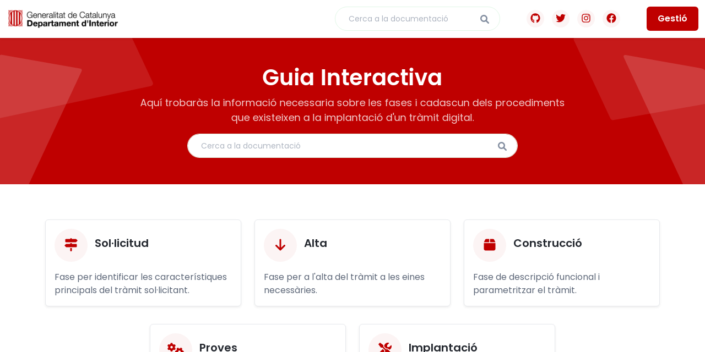

# Guia interactiva d'implantació d'un tràmit digital
Aquest lloc web és la guia interactiva del circuit per a la implantació d'un tràmit digital al Departament d'Interior de la Generalitat de Catalunya, permet cercar totes les fases i procediments dins del circuit i a més es pot consultar què es fa i qui ho fa.

## Fases i procediments
El circuit es divideix en fases i procediments, on existeixen actualment 5 fases:
- Sol·licitud
- Alta
- Construcció
- Proves
- Implantació

Cada fase té diferents procediments que poden ser duts a terme per dos diferents actors al circuit:
- Sol·licitant
- Agent GT d'Administració Digital

## Desenvolupament
El lloc web està desenvolupat mitjançant el Framework Laravel en llenguatge PHP, amb JetStream per a la gestió d'usuaris administradors que s'encarreguen de la correcció i actualització del contingut.

Actualment el lloc web es troba en fase de: `desenvolupament`
